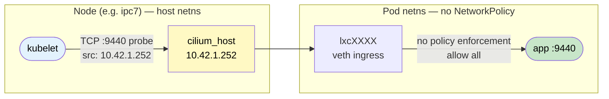
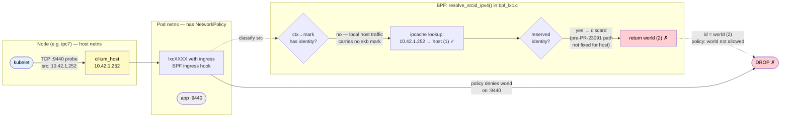
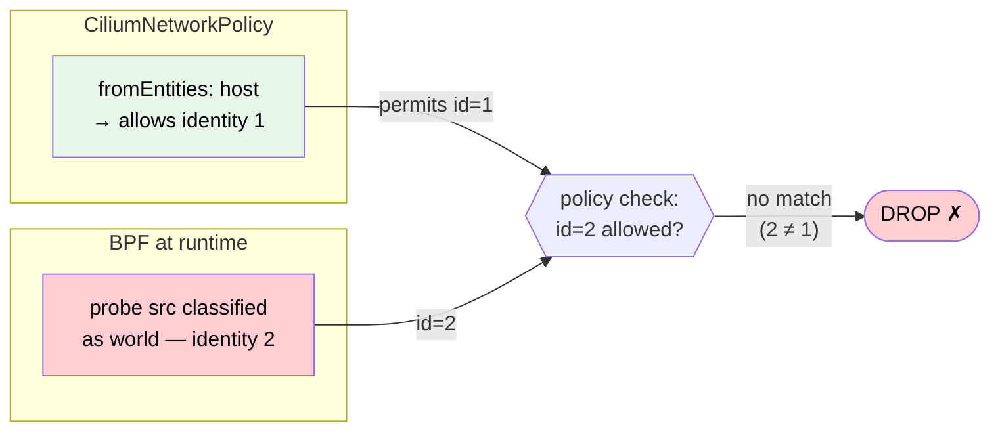
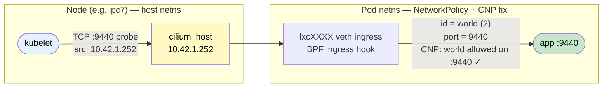

# Cilium CNI

Cilium 1.19.6 replaced Flannel (wireguard-native) as the CNI on 2026-08-01.
Flux-managed via `clusters/ipc/` (HelmRelease in the `cilium` namespace).

## k3s config (all nodes)

Flannel is disabled cluster-wide:

```yaml
# /etc/rancher/k3s/config.yaml (server and agent)
flannel-backend: none
network-policy: false   # k3s built-in enforcer off; Cilium enforces instead
```

## Helm values (revision 7, no workarounds)

```
cni.confPath        = /var/lib/rancher/k3s/agent/etc/cni/net.d
cni.binPath         = /var/lib/rancher/k3s/data/current/bin
cni.exclusive       = true
ipam.operator.clusterPoolIPv4PodCIDRList = {10.42.0.0/16}
kubeProxyReplacement = false     # k3s embedded kube-proxy still handles ClusterIP/NodePort
cgroup.autoMount.enabled = false
cgroup.hostRoot      = /sys/fs/cgroup
k8sServiceHost       = 192.168.88.58   # kube-vip VIP
k8sServicePort       = 6443
operator.replicas    = 2
```

`kubeProxyReplacement=false` means Cilium handles **NetworkPolicy enforcement** via
BPF but leaves ClusterIP/NodePort DNAT to k3s's embedded kube-proxy.

**kube-proxy must use nftables mode** (`proxy-mode=nftables` in `kube-proxy-arg`).
IPVS mode conflicts with Cilium's BPF service hooks: IPVS virtual servers are shadowed
by Cilium's BPF TC programs, making NodePorts unreachable from outside the cluster even
though the IPVS rules exist and `ipvsadm -Ln` looks correct. IPVS was also deprecated
in Kubernetes 1.35 in favour of nftables. See `config/k3s-server.yaml`.

## Pelagos workarounds required

Two Pelagos bugs had to be fixed before Cilium ran cleanly:

| Pelagos issue | Symptom | Fixed in |
|---------------|---------|----------|
| #484 | EROFS on `/var/run` hostPath → cilium-envoy CrashLoopBackOff | v0.65.69 |
| #483 | `$BIN_PATH` not reaching container → apply-sysctl-overwrites init CrashLoopBackOff | v0.65.70 |
| #492 | Duplicate `/sys/fs/bpf` mount (shared-propagated) → cilium-agent CrashLoopBackOff | v0.65.73 |

## Kubelet health probe quirk — READ THIS BEFORE ADDING NetworkPolicies

**Symptom:** pods in a namespace with a k8s NetworkPolicy fail liveness/readiness
probes with `context deadline exceeded (Client.Timeout exceeded while awaiting headers)`.
The pods work fine from inside the cluster but kubelet can't reach them.

This is a **known, open bug in Cilium** ([#43012], still unresolved as of v1.18.4,
November 2025). The root cause is a misclassification in Cilium's BPF datapath — the
probe traffic is tagged as `world` (identity 2) rather than `host` (identity 1), so
NetworkPolicy enforcement drops it. The full explanation follows.

### Cilium security identities

Every source of traffic in Cilium is assigned a **security identity** — a small integer
stamped onto packets so BPF programs can make policy decisions without looking up IP
addresses. The relevant ones:

| ID | Name | Meaning |
|----|------|---------|
| 1 | `reserved:host` | Local node's own network stack |
| 2 | `reserved:world` | Any IP external to the cluster |
| 5 | `reserved:init` | Pod before its k8s labels have resolved |

### Traffic flow: baseline (no NetworkPolicy)

When a namespace has no k8s NetworkPolicy, Cilium operates in allow-all mode and does
not consult the policy map at all. Kubelet probes pass through unimpeded:



### Traffic flow: with NetworkPolicy (broken)

The moment any k8s NetworkPolicy exists in the namespace, Cilium switches that
namespace's selected pods to default-deny and enforces the policy map on every packet.
Now the `cilium_host` misclassification matters:



### Root cause: `resolve_srcid_ipv4()` in `bpf_lxc.c`

The BPF program that handles traffic entering a pod's network namespace goes through
`resolve_srcid_ipv4()` to classify the source identity. For packets from remote pods,
the identity is encoded in the packet's skb mark (`ctx→mark`) at the sending node and
just read out. For local host traffic — including kubelet probes through `cilium_host`
— no mark is set. The function then falls through to an ipcache lookup.

Here is where it breaks. The lookup finds `10.42.x.x → host (1)`, but then checks
whether the result is a reserved identity. In the code path that was not fully fixed by
[PR #23091] (which only addressed `remote-node` identity, not `host`), a reserved result
is discarded and the function returns `world (2)` instead. The ipcache has the right
answer; the BPF program ignores it.

This can be confirmed live with `cilium-dbg monitor`:

```
drop (Policy denied) flow 0x... 10.42.1.252:PORT -> 10.42.2.X:9440
  identity world->9375
```

`world→9375` — the source (cilium_host) was classified as world (2), not host (1).

### Why `fromEntities: host` doesn't fix it

The intuitive fix is:

```yaml
ingress:
- fromEntities:
  - host
```

Cilium translates `fromEntities: host` into "allow packets with source identity 1." But
the BPF program has already stamped the probe packets with identity 2. The allow rule
and the actual identity never match:



Including `fromEntities: host` is still worth doing as a belt — it handles any future
Cilium version that fixes the classification correctly. But it is not sufficient today.

### The fix: `fromEntities: world` scoped to probe ports

Because the probe traffic arrives as identity 2 (`world`), the only rule that matches
today is one that explicitly permits `world` — but scoped tightly to the probe ports so
you are not opening the pod to the internet:



```yaml
apiVersion: cilium.io/v2
kind: CiliumNetworkPolicy
metadata:
  name: allow-kubelet-probes
  namespace: <your-namespace>
spec:
  endpointSelector: {}
  ingress:
  - fromEntities:
    - host        # belt: handles any future Cilium fix that corrects the classification
  - fromEntities:
    - world
    toPorts:
    - ports:
      - port: "<liveness-port>"
        protocol: TCP
      - port: "<readiness-port>"
        protocol: TCP
```

**Note:** if you have L7 (HTTP) `CiliumNetworkPolicy` rules in the same namespace,
`fromEntities: host` alone also fails via a different mechanism (L7 enforcement runs
through Envoy proxy, which breaks the identity path again). The `fromEntities: world` on
probe ports is the only reliable fix in all configurations. See [#34564].

### Known issues (citations)

This bug has a long history in Cilium. These are real, confirmed upstream reports:

| Issue / PR | Date | Version | Summary |
|------------|------|---------|---------|
| [#43012] | Nov 2025 | v1.18.4 | **Primary open bug**: `cilium_host` IP appears as `world` in `cilium monitor`; liveness probes fail with any CNP/NetworkPolicy present. Still unresolved. |
| [#37317] | Jan 2025 | v1.16.6 | k3s: NetworkPolicy applied before pod starts blocks readiness probes; timing-dependent. Closed as "not planned". |
| [#34564] | Aug 2024 | v1.14.12–1.15 | L7 policies cause localhost probe failures; `fromEntities: host` ineffective with Envoy L7 enforcement. |
| [#34042] | Jul 2024 | v1.16.0 | netkit datapath mode drops kubelet probes in flux-system with NetworkPolicy. Fixed in [PR #35306], backported to v1.16.4. |
| [#18183] | Dec 2021 | v1.11 (k3s) | k3s + Cilium: any NetworkPolicy breaks health probes from the host. |
| [#17839] | Nov 2021 | v1.10.4 | GKE: kubelet probe source IP denied despite `allow-localhost: always`; CNP workaround required. |
| [#18042] | Nov 2021 | v1.10.5 | eBPF host routing breaks remote-node identity classification (same structural bug). Fixed in [PR #23091]. |
| [#8911]  | Aug 2019 | v1.5.5  | Original report: host→world misclassification when iptables rules disabled. Root cause first identified here. |

[#43012]: https://github.com/cilium/cilium/issues/43012
[#37317]: https://github.com/cilium/cilium/issues/37317
[#34564]: https://github.com/cilium/cilium/issues/34564
[#34042]: https://github.com/cilium/cilium/issues/34042
[#18183]: https://github.com/cilium/cilium/issues/18183
[#17839]: https://github.com/cilium/cilium/issues/17839
[#18042]: https://github.com/cilium/cilium/issues/18042
[#8911]:  https://github.com/cilium/cilium/issues/8911
[PR #23091]: https://github.com/cilium/cilium/pull/23091
[PR #35306]: https://github.com/cilium/cilium/pull/35306

The pattern is consistent across six years and multiple Cilium versions: `cilium_host`
IP is classified as `world` in the BPF fast path; the ipcache knows better but the BPF
code ignores it for this traffic path; any NetworkPolicy then blocks the probe; the
workaround is `fromEntities: world` on probe ports via a `CiliumNetworkPolicy`.

Cilium's `allow-localhost: always` default (described in
[the Cilium policy docs](https://docs.cilium.io/en/stable/security/policy/language/))
is **supposed** to make kubelet probes always pass. In practice it is unreliable when
the probe source IP is the `cilium_host` IP rather than the loopback address, because
the `allow-localhost` bypass logic runs after the BPF program has already tagged the
packet as `world`.

### Currently patched namespaces

| Namespace | Probe ports | Policy file |
|-----------|-------------|-------------|
| flux-system | 9440 (health), 9090 (source-controller storage), 9443 (notification webhook) | `manifests/cilium-netpols/flux-system-allow-kubelet-probes.yaml` |

`manifests/cilium-netpols/` is Flux-managed (`clusters/ipc/cilium-netpols.yaml`) and
reconciles automatically on rebuild.

**Rule for the future:** any namespace you add a k8s NetworkPolicy to needs a
corresponding `CiliumNetworkPolicy allow-kubelet-probes` entry in
`manifests/cilium-netpols/` before the pods will pass health checks.

## k8s NetworkPolicy vs CiliumNetworkPolicy

Understanding the choice between these two APIs is key to understanding both the probe
quirk and how to avoid it.

### How each API triggers enforcement

**k8s `NetworkPolicy`** — the standard Kubernetes API. Cilium honours it, but the
semantics are blunt: the moment any NetworkPolicy selects a pod, Cilium switches that
pod to **default-deny** for all ingress (or egress) not explicitly permitted. There is
no way in the standard API to express "allow from the host entity" — you can only use
pod selectors, namespace selectors, and IP CIDRs. You cannot name Cilium's `host`
entity in a k8s NetworkPolicy. So when you write a k8s NetworkPolicy, you
**unavoidably need a CNP alongside it** to allow kubelet probes, because the standard
API has no vocabulary for it.

**`CiliumNetworkPolicy` (CNP)** — Cilium's own CRD. Same default-deny trigger, but
it exposes Cilium's full policy model, including `fromEntities: host/world/cluster`.
If you write all your policies as CNPs from the start, you can fold the probe
allowance directly into your primary policy and never need a separate
`allow-kubelet-probes` object.

### Could you avoid all this by only using CiliumNetworkPolicy?

Largely yes — but **the underlying BPF bug does not go away**. The
`cilium_host → world` misclassification exists regardless of which API you use; you
still need `fromEntities: world` on probe ports somewhere. The difference is
*when* you discover that:

| Approach | Discovery point | Extra object needed |
|----------|----------------|---------------------|
| k8s NetworkPolicy | Probes break after you add the policy | Yes — separate CNP `allow-kubelet-probes` |
| CiliumNetworkPolicy only | At policy-writing time (you include probe ports in your primary policy) | No — fold it into the main CNP |

So with CNP-only you never get a surprise breakage — you just write the host/world
allowance once in your main policy and it's done. With k8s NetworkPolicy you always
end up needing a CNP on the side anyway, so you are always using both APIs.

### Why we use k8s NetworkPolicy for experiments

Experiment 09 (`experiments/09-network-policies/`) deliberately uses standard k8s
`NetworkPolicy` objects to verify that Cilium correctly enforces the portable,
CNI-agnostic API. If that API didn't work, swapping Cilium for another CNI would break
things silently. Portability and standards compliance are the goal, so the extra
`allow-kubelet-probes` CNP is an accepted cost.

For namespaces we control long-term that will never change CNI (flux-system,
monitoring, etc.), writing CNPs exclusively would be a reasonable alternative — and
would let you inline the probe allowance rather than maintaining a separate file in
`manifests/cilium-netpols/`. We haven't done this because it would make those
namespaces Cilium-specific at the policy layer, which complicates any future CNI
migration.

### Summary

| | k8s NetworkPolicy | CiliumNetworkPolicy only |
|---|---|---|
| Portability | Any CNI | Cilium only |
| Probe allowance | Requires separate CNP | Inline in main policy |
| Bug still present | Yes | Yes |
| Surprise breakage | Yes (probes fail silently) | No (you write allowance upfront) |
| Our use | Experiments, portability testing | Not used for existing namespaces |

## Diagnosing probe failures

```bash
# 1. Find the Cilium pod on the same node as the failing pod
kubectl get pod -n <ns> <pod> -o jsonpath='{.spec.nodeName}'
CILIUM_POD=$(kubectl get pod -n cilium -l app.kubernetes.io/name=cilium-agent \
  --field-selector spec.nodeName=<node> -o jsonpath='{.items[0].metadata.name}')

# 2. Find the endpoint ID
kubectl exec -n cilium $CILIUM_POD -- cilium endpoint list | grep <pod-ip>

# 3. Watch for drops while the probe fires
kubectl exec -n cilium $CILIUM_POD -- \
  cilium-dbg monitor --type drop --related-to <endpoint-id>

# 4. Confirm the drop shows "identity world->..." (not "host->...")
# That confirms the cilium_host misclassification — apply the CNP above.
```

## Verifying NetworkPolicy enforcement

Experiment 09 (`experiments/09-network-policies/`) tests enforcement end-to-end:

```bash
kubectl apply -f experiments/09-network-policies/

# client → backend should be BLOCKED (wget exits 1)
kubectl exec -n netpol-demo deploy/client -- \
  wget -qO- --timeout=5 http://10.43.x.x  # backend ClusterIP

# frontend → backend should be ALLOWED (nginx 200)
kubectl exec -n netpol-demo deploy/frontend -- \
  wget -qO- --timeout=5 http://10.43.x.x
```

Both directions verified working on v0.65.73 (2026-08-01).

## Rebuild checklist

On a fresh cluster, Flux bootstrapping brings back Cilium automatically once the
HelmRelease in `clusters/ipc/` reconciles. The kubelet-probe CNPs in
`manifests/cilium-netpols/` also reconcile automatically.

Manual steps that are **not** automated:

1. k3s server/agent configs (`config/`) must have `flannel-backend: none` and
   `network-policy: false` before the node joins — done by `install-pelagos.sh`.
2. Pelagos v0.65.73+ required (earlier versions crash Cilium — see table above).
3. If you add a new namespace with NetworkPolicies, add a
   `CiliumNetworkPolicy allow-kubelet-probes` to `manifests/cilium-netpols/`.
