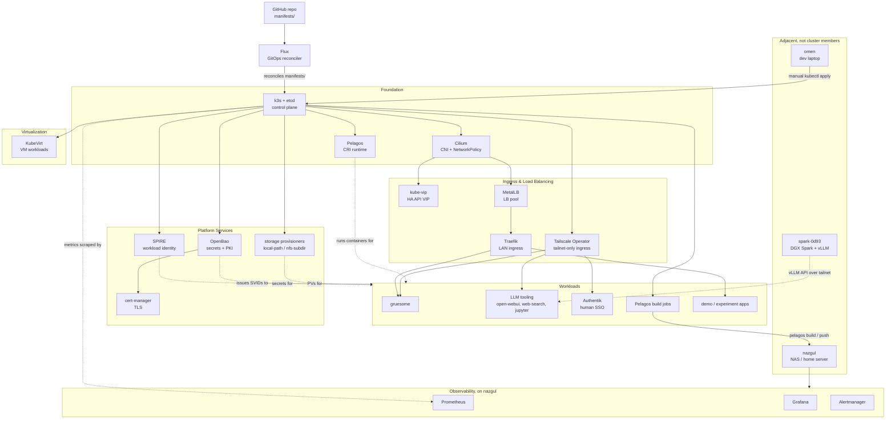

# Cluster Architecture: What's Running and Why

A conceptual map of the [k3s](#ref-k3s)/[k8s](#ref-kubernetes) cluster (*ipc4-9*) — organized by the *purpose* each
component serves, not by installation order or namespace. Hardware/OS specifics and
a quick-reference software component table are in the appendices, kept separate so this
body stays about reasoning rather than inventory.

\begin{flushleft}
{\footnotesize\itshape Figure 1. Layered view of the cluster's platform services and workloads, grouped by architectural role.}
\end{flushleft}

## 1. Identity & Workload Attestation

**[SPIRE](#ref-spire)** provides cryptographic identity for workloads, not just network-perimeter
trust. Each node attests itself to the SPIRE server using its TPM (`tpm_devid` node
attestor) — proof that a workload is genuinely running on specific, attested
hardware, not just "something that can reach the cluster network." SPIRE then
issues short-lived SVIDs (SPIFFE Verifiable Identity Documents) that workloads use
to authenticate to each other.

The SPIRE server is pinned to *ipc4* specifically, because the TPM DevID CA tooling
only lives there. A `signer-unix` sidecar re-signs a trust bundle every 5 minutes;
agent pods fail `verify-bundle` and won't start if that pipeline stalls, which is
why bundle-token-age is one of the more sensitive alerts on this cluster.

This is the foundation zero-trust rests on: everything downstream (mTLS between
services, workload-scoped secret access) assumes SPIRE identity is trustworthy.

## 2. Secrets & Key Management

**[OpenBao](#ref-openbao)**, a [Vault](#ref-vault) fork, replaces the cluster's
previous 3-node Raft HA Vault deployment (decommissioned 2026-08-05). OpenBao's Transit engine auto-unseals the
in-cluster instance, eliminating the manual-unseal step that was a real
operational hazard under the old Vault setup. OpenBao is also the backing PKI
engine (see §6) and generally the place any workload goes for dynamic credentials
rather than a hardcoded Secret.

## 3. Network Security & Segmentation

**[Cilium](#ref-cilium)** is the CNI (replacing k3s's default flannel —
`flannel-backend: none` in the server configs). It runs
`kube-proxy-replacement=false` over vxlan and enforces
[Kubernetes](#ref-kubernetes) `NetworkPolicy` via eBPF. Any namespace with a NetworkPolicy
needs an explicit `CiliumNetworkPolicy allow-kubelet-probes` alongside it, or
kubelet health checks get blocked by the same enforcement that's supposed to be
protecting the workload — a real, recurring gotcha on this cluster.

Cilium is also what makes this a genuine microsegmentation exercise rather than a
flat pod network: the `netpol-demo` namespace runs three small pods (`client`,
`frontend`, `backend`) behind a default-deny NetworkPolicy with one explicit allow
rule (`frontend` → `backend`). It exists purely as a live enforcement probe —
routine health checks confirm `client` → `backend` is blocked and `frontend` →
`backend` succeeds, so a Cilium regression that silently stopped enforcing
NetworkPolicy would be caught immediately rather than discovered the next time it
actually mattered.

Underneath all of this, **[CoreDNS](#ref-coredns)** is the cluster's internal DNS
— every in-cluster Service name (`openbao.openbao.svc`, etc.) resolves through it.
It's the default that ships with k3s, unlike SPIRE or Cilium which were
deliberately chosen — but nothing else in this document works without it.

## 4. Ingress & Load Balancing

The underlying bare-metal hosts have no load-balancer services, so three
components stand in for one:

- **[kube-vip](#ref-kube-vip)** floats a VIP (`192.168.88.58`) across the three
  control-plane nodes for HA API server access —
  `k8s-api.home.skeptomai.com` resolves here.
- **[MetalLB](#ref-metallb)** (L2/ARP mode) provides `LoadBalancer` Services from
  a pool (`.240-.250`); k3s's built-in ServiceLB is disabled so MetalLB is the
  only path.
- **[Traefik](#ref-traefik)** sits on the MetalLB-assigned `.240` address as the
  actual ingress controller/reverse proxy in front of HTTP(S) services.

That's the LAN-facing path. There's a second, independent one for tailnet-only
reach: the **Tailscale Kubernetes Operator** (running in the `tailscale`
namespace) watches for either an `Ingress` using the `tailscale` IngressClass or
a plain Service annotated `tailscale.com/expose: "true"`, and spins up a
dedicated proxy pod for it. `authentik` and `open-webui` use this path
exclusively — no Traefik route exists for either of them, they're reachable only
on the [tailnet](#ref-tailscale). `jupyter` and `web-search` use the simpler
Service-annotation form, same effect. `gruesome` is the interesting case: it uses
*both* paths at once — `gruesome.home.skeptomai.com` via Traefik on the LAN, and
its own tailnet hostname via the operator, simultaneously.

## 5. GitOps & Delivery

**[Flux](#ref-flux)** continuously reconciles `manifests/` from the GitHub repo into cluster
state — kube-vip, MetalLB, Cilium NetworkPolicies, and most platform services come
back automatically after a rebuild once Flux itself is bootstrapped. Not
everything goes through Flux, though: some experiments are applied manually via
`kubectl apply` from *omen* (a laptop used for development, at times remote from
the cluster LAN and reached over the [tailnet](#ref-tailscale)) against the local
repo, a deliberate split between
"platform, GitOps-managed" and "experiment, hand-applied."

## 6. TLS / PKI

**[cert-manager](#ref-cert-manager)** automates certificate issuance and renewal. The interesting part
is *what* signs those certificates: the `vault-pki-issuer` ClusterIssuer keeps its
legacy name (renaming it would break existing `Certificate` references) but
actually points at `https://openbao.openbao.svc:8200`, `path: pki_int/sign/home-lab`
— i.e., OpenBao is the real intermediate CA now, reached through cert-manager's
Vault-API-compatible issuer type. There's also a separate `internal-ca-issuer`
(self-signed) for cases that don't need the full chain. This is one of the places
where §2's secret store and §6's PKI aren't really separate systems, just separate
concerns against the same backend.

## 7. Storage

Two tiers, chosen per workload:

- **[local-path-provisioner](#ref-local-path-provisioner)** — fast, node-local
  disk, the default dynamic PV provisioner. No cross-node availability.
- **[nfs-subdir-external-provisioner](#ref-nfs-subdir-external-provisioner)** —
  shared network storage backed by an NFS export, for anything that needs state
  visible from more than one node.

## 8. Observability

Deliberately **not** fully in-cluster: [Prometheus](#ref-prometheus),
[Grafana](#ref-grafana), and [Alertmanager](#ref-alertmanager) run
standalone via Pelagos on *nazgul* (a NAS server — the single most important home
server, used to host centralized services independent of the cluster's own
uptime), outside k3s entirely. This is intentional — the
cluster is powered down every night on a schedule, and monitoring that lived
*inside* the thing it monitors would go blind exactly when startup/shutdown
behavior most needs watching. In-cluster, there's `kube-state-metrics` and a
`node-exporter` DaemonSet feeding that external stack, plus Flux's own controller
metrics exposed via a NodePort patch. Alerts route to Pushover; some (SPIRE
exporter down, etc.) are expected to fire during the nightly shutdown window and
self-clear on the morning startup, which is a real distinction from an alert that
indicates an actual fault.

Separately, **[metrics-server](#ref-metrics-server)** provides the live,
short-lived resource metrics behind `kubectl top` and any future
horizontal-pod-autoscaling — a different job from Prometheus's persisted,
alertable history, even though both are "metrics."

## 9. Container Runtime

**[Pelagos](#ref-pelagos)** is the CRI implementation on every node (`unix:///run/pelagos/cri.sock`)
— a custom Rust runtime, not containerd/CRI-O/Docker. This isn't just an
infrastructure choice: the cluster doubles as the primary integration-test
environment for Pelagos itself, coordinated with a sister agent/project that
builds and releases it. Cluster bugs get filed upstream against Pelagos with the
`cluster-origin` label; Pelagos releases get validated against this cluster before
being considered done.

## 10. Virtualization

**[KubeVirt](#ref-kubevirt)** runs actual VMs (`virt-handler`, `virt-controller`, `virt-api`,
`virt-operator`) as Kubernetes-managed workloads, live-migratable across nodes.
This lets anything needing full VM isolation, or a non-Linux/non-container guest,
sit under the same control plane as everything else rather than requiring a
separate hypervisor layer.

---

## Workloads

The platform services above exist to *serve* these — the actual reason the
cluster is running:

- **[gruesome](#ref-gruesome)** — a hosted deployment of a Rust Z-Machine interpreter (plays
  classic Infocom text adventure games, e.g. Zork I). Real dogfood: built with
  Pelagos, pushed to the cluster's own local registry, and run as an ordinary
  Deployment behind MetalLB — the simplest possible "does the whole stack work
  end-to-end" workload.
- **LLM tooling** — [`open-webui`](#ref-open-webui) (chat UI), a self-hosted
  `web-search` proxy (wraps [DuckDuckGo](#ref-duckduckgo), used as a tool-call
  target so LLM agents don't need direct internet egress), and a
  [Jupyter](#ref-jupyter) notebook environment. The actual LLM inference
  ([Nemotron-3-Super](#ref-nemotron) via [vLLM](#ref-vllm)) runs on a separate
  DGX Spark node reached over the tailnet — adjacent infrastructure, not itself
  a cluster workload.
- **Pelagos build jobs** — ephemeral, one-shot k8s Jobs (pinned to *ipc4* for a
  consistent hostPath mount of the Pelagos binary/store) that run `pelagos build`
  + `pelagos image push` against a cloned repo, the in-cluster mechanism for
  building and publishing container images without Docker or Kaniko on *omen*.
- **[Authentik](#ref-authentik)** — self-hosted SSO/identity provider for *humans* logging into
  applications. Distinct from §1's SPIRE, which is workload-to-workload identity;
  Authentik is the user-facing auth layer sitting in front of apps.
- **Demo/experiment apps** (`https-demo`, `netpol-demo`, `ipvs-demo`) — living
  examples from the numbered `experiments/` directory, kept running rather than
  torn down so they double as continuous verification of the concepts they
  demonstrate (TLS via cert-manager, NetworkPolicy enforcement, IPVS kube-proxy
  mode).

---

\newpage

## Appendix A: Hardware & OS Reference

| | |
|---|---|
| Nodes | *ipc4-9*, six identical-generation Intel machines |
| *ipc4-6* | HP Elite Mini 800 G9, Intel Core i5-12500T (12th Gen), 6c/12t, 32GB RAM, NVMe — role: control-plane + etcd, `node-class=performance` |
| *ipc7-9* | Intel Core i5-12500 (12th Gen, non-T), 6c/12t, 32GB RAM, ~256GB NVMe — role: worker, `node-class=fastest` |
| OS | Ubuntu 26.04 LTS, kernel 7.0.x |
| k3s | v1.35.5 |
| TPM (attestation hardware) | *ipc4-7*: Nuvoton NPCT75x · *ipc8-9*: Infineon SLB9672 |
| Container runtime | Pelagos CRI, all nodes |
| History | *ipc1-3* (Pentium Gold G5400T) were the original control plane until 2026-07-05, retired and replaced by *ipc4-6* |

**Adjacent, not cluster members:**

| | |
|---|---|
| *spark-0d93* | NVIDIA DGX Spark (GB10 GPU) — standalone, runs vLLM/Nemotron-3-Super via Pelagos (non-CRI mode); reached over Tailscale; wired Ethernet as of 2026-08-19 (was WiFi) |
| *nazgul* | NAS server — the single most important home server, host for centralized services; runs Prometheus/Grafana/Alertmanager, the [Zot](#ref-zot) registry mirror/local registry, and other services deliberately kept outside the k3s cluster |
| *omen* | Development laptop — at times remote from the cluster LAN, reached via the tailnet; source of `kubectl apply` for hand-applied manifests and the origin of the local repo clone |

**Network:**

| IP(s) | Purpose |
|---|---|
| `.55-.57` | *ipc4-6* (control-plane), static MikroTik leases by MAC |
| `.58` | kube-vip control-plane VIP (`k8s-api.home.skeptomai.com`) |
| `.63-.65` | *ipc7-9* (workers), static MikroTik leases by MAC |
| `.240-.250` | MetalLB LoadBalancer pool |

\newpage

## Appendix B: Software Component Reference

| Component | Category | Reason for being | Depends on / notes |
|---|---|---|---|
| SPIRE | Identity | TPM-attested workload identity, SVID issuance | TPM hardware (server pinned to *ipc4*), k8s API |
| OpenBao | Secrets | Secret storage, Transit auto-unseal, PKI backend | Replaces old 3-node Raft HA Vault |
| Cilium | Networking | CNI, NetworkPolicy enforcement via eBPF | Replaces flannel; needs `allow-kubelet-probes` netpol per namespace |
| CoreDNS | Networking | Cluster-internal DNS resolution | k3s-bundled, not a deliberate choice |
| kube-vip | Networking | HA control-plane VIP | L2/ARP, *ipc4-6* |
| MetalLB | Networking | LoadBalancer IP pool | L2/ARP mode; replaces k3s ServiceLB |
| Traefik | Networking | Ingress controller / reverse proxy (LAN path) | Sits behind MetalLB `.240` |
| Tailscale Operator | Networking | Ingress path for tailnet-only exposure | Per-service proxy pods, `tailscale` namespace |
| Flux | GitOps | Reconciles `manifests/` from GitHub | Not all workloads are Flux-managed |
| cert-manager | PKI | Automated cert issuance/renewal | Issuers backed by OpenBao + self-signed |
| local-path-provisioner | Storage | Fast node-local dynamic PVs | No cross-node availability |
| nfs-subdir-external-provisioner | Storage | Shared network storage | Backed by an NFS export |
| kube-state-metrics / node-exporter | Observability | Cluster/node metrics feed | Scraped by external Prometheus (*nazgul*) |
| Prometheus / Grafana / Alertmanager | Observability | Metrics, dashboards, alerting | Runs outside k3s, on *nazgul*, by design |
| metrics-server | Observability | Live resource metrics for `kubectl top` / HPA | Separate from Prometheus's persisted history |
| Pelagos | Container Runtime | CRI implementation (custom Rust, not Docker) | Every node; also the project this cluster validates |
| KubeVirt | Virtualization | Runs VMs as k8s-managed workloads | virt-handler/controller/api/operator |
| gruesome | Workload | Hosted Z-Machine interpreter (text adventures) | Built via Pelagos, pushed to local registry |
| open-webui | Workload | Chat UI for LLM interaction | Talks to spark's vLLM endpoint |
| web-search | Workload | Self-hosted DuckDuckGo proxy for tool-calling | Used by gptel's `web_search` tool |
| jupyter | Workload | Interactive notebook environment | |
| Authentik | Workload | Human-facing SSO/identity provider | Distinct from SPIRE (workload identity) |
| https-demo / netpol-demo / ipvs-demo | Workload | Living examples from `experiments/` | Kept running as continuous verification |

\newpage

## Appendix C: Online References

Canonical project source for every named technology in this document, alphabetical.

- []{#ref-alertmanager} **Alertmanager** — <https://github.com/prometheus/alertmanager>
- []{#ref-authentik} **Authentik** — <https://github.com/goauthentik/authentik>
- []{#ref-cert-manager} **cert-manager** — <https://github.com/cert-manager/cert-manager>
- []{#ref-cilium} **Cilium** — <https://github.com/cilium/cilium>
- []{#ref-coredns} **CoreDNS** — <https://github.com/coredns/coredns>
- []{#ref-duckduckgo} **DuckDuckGo** — <https://duckduckgo.com/>
- []{#ref-flux} **Flux** — <https://github.com/fluxcd/flux2>
- []{#ref-grafana} **Grafana** — <https://github.com/grafana/grafana>
- []{#ref-gruesome} **gruesome** — <https://github.com/skeptomai/gruesome>
- []{#ref-jupyter} **Jupyter** — <https://jupyter.org/>
- []{#ref-k3s} **k3s** — <https://github.com/k3s-io/k3s>
- []{#ref-kube-vip} **kube-vip** — <https://github.com/kube-vip/kube-vip>
- []{#ref-kubernetes} **Kubernetes** — <https://github.com/kubernetes/kubernetes>
- []{#ref-kubevirt} **KubeVirt** — <https://github.com/kubevirt/kubevirt>
- []{#ref-local-path-provisioner} **local-path-provisioner** — <https://github.com/rancher/local-path-provisioner>
- []{#ref-metallb} **MetalLB** — <https://github.com/metallb/metallb>
- []{#ref-metrics-server} **metrics-server** — <https://github.com/kubernetes-sigs/metrics-server>
- []{#ref-nemotron} **Nemotron-3-Super** — <https://huggingface.co/nvidia/NVIDIA-Nemotron-3-Super-120B-A12B-NVFP4>
- []{#ref-nfs-subdir-external-provisioner} **nfs-subdir-external-provisioner** — <https://github.com/kubernetes-sigs/nfs-subdir-external-provisioner>
- []{#ref-open-webui} **open-webui** — <https://github.com/open-webui/open-webui>
- []{#ref-openbao} **OpenBao** — <https://github.com/openbao/openbao>
- []{#ref-pelagos} **Pelagos** — <https://github.com/pelagos-containers/pelagos>
- []{#ref-prometheus} **Prometheus** — <https://github.com/prometheus/prometheus>
- []{#ref-spire} **SPIRE** — <https://github.com/spiffe/spire>
- []{#ref-tailscale} **Tailscale** — <https://tailscale.com/>
- []{#ref-traefik} **Traefik** — <https://github.com/traefik/traefik>
- []{#ref-vault} **Vault** — <https://github.com/hashicorp/vault>
- []{#ref-vllm} **vLLM** — <https://github.com/vllm-project/vllm>
- []{#ref-zot} **Zot** — <https://github.com/project-zot/zot>
