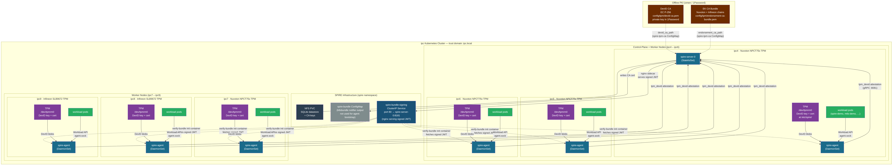
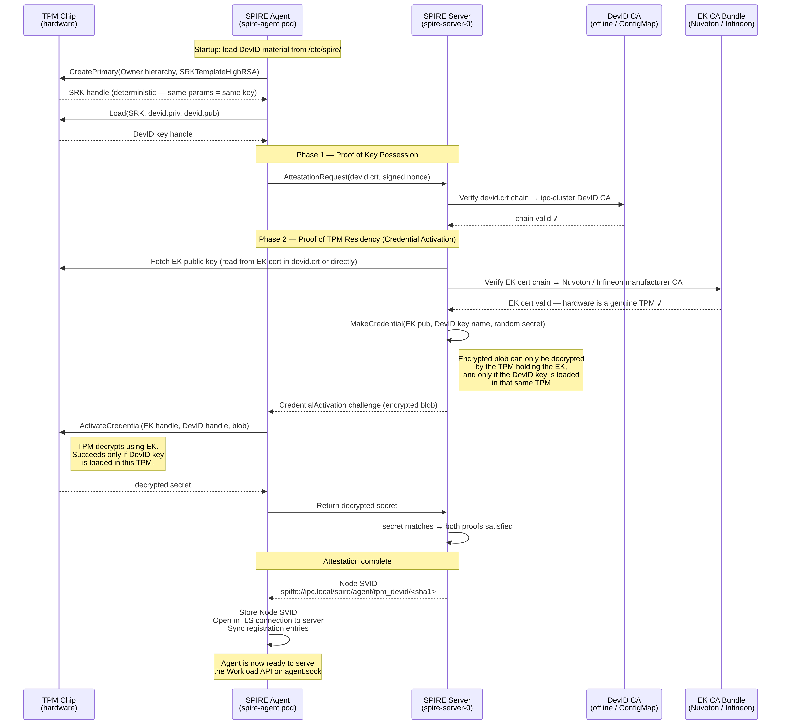
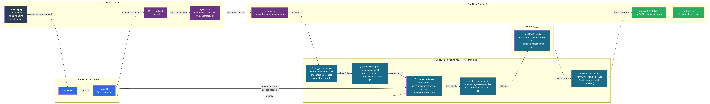
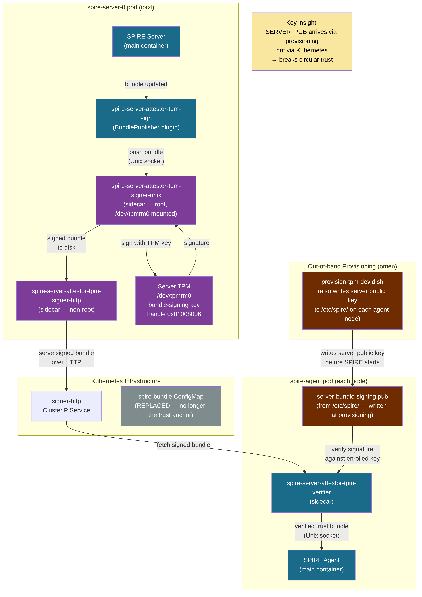

# SPIRE/SPIFFE: Concepts, Configuration, and Infrastructure

## What Is Running on This Cluster

**Trust domain:** `ipc.local`

**SPIRE Server** — StatefulSet (1 replica) on the cluster. CA keys and registration
entries live in SQLite on a 1Gi PVC provisioned by the `nfs-subdir-external-provisioner`
StorageClass, backed by nazgul (`192.168.89.2`) at `/mnt/primary_storage/k8s-nfs`.
Listens on gRPC port 8081 via a headless service. Flux manages it from `manifests/spire/`.

**SPIRE Agent** — DaemonSet on all 6 nodes.

`hostPID: true` is required for workload attestation. When a workload calls the Workload
API socket, the agent reads `SO_PEERCRED` from the Unix domain socket connection, which
gives it the calling process's PID. Under normal Kubernetes pod isolation, PIDs are
namespaced — each pod sees its own PID 1 and the host processes are invisible. With
`hostPID: true` the agent's container shares the host PID namespace, so `SO_PEERCRED`
returns the *host* PID of the calling process. The agent then reads
`/proc/<host-pid>/cgroup` to extract the container ID, and from there calls the kubelet
API to get the pod's namespace, service account, and labels. Without `hostPID: true`,
`SO_PEERCRED` returns PID 0 and the entire workload attestation chain breaks.

The Workload API socket at `/run/spire/sockets/agent.sock` is a Unix domain socket
created by the agent inside the container. The DaemonSet mounts
`/run/spire/sockets` as a `hostPath` volume with `DirectoryOrCreate`, which means the
directory is created on the node's filesystem if it doesn't exist, and the socket file
lives there rather than inside the container's ephemeral overlay filesystem. Any pod on
the same node that mounts `/run/spire/sockets` as a hostPath gets access to the same
socket — this is how workload containers reach the agent without any service discovery or
network routing. The socket is node-local by design: the agent on ipc7 only knows about
workloads on ipc7, and those workloads only connect to ipc7's agent socket.

Each agent bootstraps its trust bundle via the `verify-bundle` init container (see TPM
Server Attestation below), which fetches the bundle signed by the server's TPM key and
writes it to a shared emptyDir before the agent starts. The server also maintains the
`spire-bundle` ConfigMap via the `k8sbundle` notifier, but agents no longer bootstrap
from it directly.

### Cluster Architecture



---

## SPIFFE and SPIRE — the Concepts

**SPIFFE** (Secure Production Identity Framework For Everyone) is a standard, not
software. It defines:

- A URI format for workload identity: `spiffe://<trust-domain>/<path>`
- What a valid credential (SVID) looks like
- How an agent presents that credential to workloads (the Workload API)

**SPIRE** is the reference implementation of SPIFFE: a server that acts as a CA and a
registration database, plus per-node agents that handle attestation and SVID issuance.

### What Is an SVID, and Who Is Attesting to Whom?

An SVID is an **identity document**, not a safety certificate. The analogy is a passport:
a passport doesn't say "this person is trustworthy" — it says "this person is who they
claim to be, and a government vouches for that." What the receiving party does with that
identity is their own business.

This distinction matters because attestation flows in multiple directions simultaneously.
Here is the full chain as implemented on this cluster:

**0. Agent trusts the server (TPM-signed bundle)**
Before the SPIRE agent starts, the `verify-bundle` init container fetches the trust bundle
JWT from the `spire-bundle-signing` service, verifies the RS256 signature against
`/etc/spire/server-bundle-signing.pub` — the server's TPM public key written to the node
during physical provisioning — and only writes the bundle to disk if the signature is
valid. The agent will not start if this check fails. This means the agent's trust in the
server is rooted in the server's hardware TPM, not in Kubernetes infrastructure.

**1. Server trusts the agent (TPM DevID credential activation)**
The agent sends its DevID certificate (signed by the cluster DevID CA) and proves it holds
the corresponding private key by signing a server-issued nonce. The server then performs a
credential activation challenge using the node's EK public key: it encrypts a secret so
that only the TPM holding the EK can decrypt it, and only if the DevID key is also loaded
in that same TPM. The agent's TPM decrypts and returns the secret. Both proofs together —
key possession and TPM residency — satisfy the server that the agent is running on a real,
enrolled node.

**2. Agent attests the workload (SO_PEERCRED + kubelet)**
When a workload process connects to `agent.sock`, the agent reads `SO_PEERCRED` from the
Unix socket to get the caller's host PID, walks `/proc/<pid>/cgroup` to extract the
container ID, and calls the kubelet API to get the pod's namespace, service account, and
labels. The workload never claims its own identity — the agent determines it by
observation, from outside the workload.

**3. Server issues an SVID to the workload via the agent**
The agent presents the observed workload identity to the server. If it matches a
registration entry, the server signs an X.509 SVID and returns it to the agent, which
hands it to the waiting workload process.

**4. Workload presents the SVID to a peer**
The workload now has a cryptographically-signed identity document. When it connects to
another service — `mtls-server`, Vault, an API gateway — it presents the SVID as its TLS
client certificate.

**5. Peer verifies against the trust bundle**
The receiving service verifies the SVID's signature against the SPIRE CA trust bundle.
No pre-shared secrets, no sidecar injection of credentials, no service-specific token. If
the signature checks out and the SPIFFE ID matches an access policy, the connection is
accepted.

Steps 0–3 are handled entirely by SPIRE. Steps 4–5 are between the workload and whatever
it is talking to; SPIRE's job is to get a cryptographically-grounded identity into the
workload's hands without the workload needing to manage secrets itself.

---

## Node Attestation

The agent can't just claim "I'm a legitimate node" — the server needs proof. **Node
attestation** is how the agent proves to the server that it's running on a real,
authorized Kubernetes node.

This cluster uses **k8s_psat** (Kubernetes Projected Service Account Token):

1. Kubernetes issues a short-lived projected SAT to the agent pod (audience:
   `spire-server`, expiry: 7200s). This token is in the pod's filesystem at
   `/var/run/secrets/tokens/`.
2. The agent sends this token to the SPIRE server over gRPC.
3. The server calls the Kubernetes **TokenReview API** to validate it — Kubernetes
   confirms the token is real, which SA issued it, and which pod it was issued to.
4. The server checks its allow-list (`spire:spire-agent` SA) and grants the agent a
   **Node SVID** with SPIFFE ID `spiffe://ipc.local/k8s-node`.

From that point on, the agent authenticates to the server using the Node SVID (mTLS on
the gRPC channel). The PSAT is only used once for initial bootstrapping.

**Why PSAT instead of something else?** These nodes have no TPM, no cloud provider
identity (AWS EC2 instance identity documents, GCP GCE tokens, etc.), and no
pre-provisioned join token — PSAT is the right choice for bare-metal Kubernetes. The
trust root is "Kubernetes itself validated this token."

> **Note:** this cluster has been upgraded to TPM DevID node attestation (`tpm_devid`).
> The k8s_psat description above is retained as conceptual background; the actual
> implementation uses the hardware TPM and is documented in the TPM Attestation sections.

### TPM DevID Node Attestation Flow



---

## Workload Attestation

After a node is attested, the agent needs to verify that a calling workload is what it
claims to be before issuing an SVID. This happens entirely on-node; no server round-trip
is needed.

The flow for this cluster (`k8s` workload attestor):

1. Workload connects to `/run/spire/sockets/agent.sock` (a Unix domain socket).
2. The agent reads **SO_PEERCRED** from the socket — this gives the calling process's
   PID. This is why `hostPID: true` is required; without it, PIDs are namespaced and
   SO_PEERCRED returns 0.
3. The agent reads `/proc/<pid>/cgroup` to extract the container ID.
4. The agent calls the **kubelet API** (using `MY_NODE_NAME`) to get pod metadata for
   that container: namespace, service account, pod name, labels, etc.
5. The agent compares that metadata against its **registration entries** (synced from the
   server).
6. If a match is found, the agent issues an SVID for the matching SPIFFE ID.

`use_new_container_locator: true` in the agent config causes the agent to try mountinfo
first (more reliable with cgroupv2) before falling back to the cgroup path.

### Pelagos Compatibility Fixes

Two Pelagos bugs affected SPIRE workload attestation on this cluster:

| Bug | Symptom | Fixed |
|-----|---------|-------|
| `hostPID: true` ignored (#299) | SO_PEERCRED returned PID 0; server rejected | v0.65.7 |
| 32-char container IDs (#301) | SPIRE regex expected 64-char hex; attestation failed | v0.65.8 |

Both are fixed in the running version (v0.65.47).

### Workload Attestation Flow



---

## Registration Entries

Registration entries are the policy database — they tell the server (and thus agents)
which workloads should receive which SPIFFE IDs. Each entry has:

- **SPIFFE ID**: the identity to issue (`spiffe://ipc.local/demo-app`)
- **Parent ID**: who must attest the caller first (`spiffe://ipc.local/k8s-node` —
  meaning "the workload must be on an attested node")
- **Selectors**: the conditions that must all match (`k8s:ns:spire-demo`,
  `k8s:sa:demo-sa`)

### Current Pattern: Imperative Registration

A Kubernetes Job runs `kubectl exec` into the server pod and calls
`spire-server entry create`. This works but has a GitOps gap — entries live in SQLite on
the NFS PVC, not in Git. If the PVC is lost or the cluster is rebuilt, entries must be
re-registered.

### GitOps Alternative: ClusterSPIFFEID

The **SPIRE Controller Manager** provides a `ClusterSPIFFEID` CRD. Entries are declared
as Kubernetes resources in Git; the controller reconciles them into SPIRE continuously.
This closes the GitOps gap. Architected in `docs/spire-trust-chain-clusterspiffeid.mmd`
but not yet deployed.

---

## SVIDs — the Two Forms

**SVID** = SPIFFE Verifiable Identity Document. Two formats:

### X.509 SVID

A standard X.509 certificate with one key addition: the SPIFFE ID is encoded in the
certificate's **Subject Alternative Name (SAN)** as a URI
(`spiffe://ipc.local/demo-app`). Inspect with:

```
openssl x509 -in svid.pem -text -noout | grep URI
```

Properties:

- **Short-lived** (default TTL: 1 hour). The agent rotates them automatically before
  expiry, typically at the 50% mark.
- Carries the full chain: leaf cert + intermediate(s) up to the trust bundle.
- Used for **mTLS** — both sides present their SVID as the TLS client/server cert, and
  verify the peer's cert against the trust bundle. This is what experiment 21
  demonstrates.
- Opaque to network intermediaries (the identity is in the cert, not the payload).

### JWT SVID

A signed JWT with the SPIFFE ID in the `sub` claim and an `aud` (audience) claim.

Properties:

- Also short-lived. **Not** automatically rotated — the workload must re-fetch when it
  needs a fresh one.
- Used when mTLS is not possible: HTTP APIs where identity must be passed in a header
  (`Authorization: Bearer <jwt>`), or when a network intermediary (load balancer, API
  gateway) terminates TLS before reaching the workload.
- The receiving service verifies the JWT signature against the trust bundle's public key,
  not by doing a TLS handshake.
- Fetch with: `spire-agent api fetch jwt -audience <target-service> -socketPath ...`
- The **audience field matters**: a JWT fetched for audience `api-gateway` won't be
  accepted by a verifier expecting `payments-service`. This prevents token replay across
  services.

### When to Use Which

| Scenario | Format |
|----------|--------|
| Service-to-service where you control both ends | X.509 (mTLS) |
| HTTP API, identity passed in header | JWT |
| Identity through a TLS-terminating proxy | JWT |
| Authenticating to Vault (JWT auth method) | JWT |
| Envoy/service mesh transparent mTLS | X.509 |

---

## The Trust Bundle

The trust bundle is the SPIRE CA's root certificate(s). Everything signed by SPIRE is
verifiable against it. On this cluster:

- The server writes it to the `spire-bundle` ConfigMap in the `spire` namespace (via the
  `k8s_bundle` notifier).
- Agents mount it at startup to bootstrap their TLS connection to the server.
- Workloads receive it alongside their SVID when calling the Workload API — so they can
  verify peers without any pre-shared secrets or manual cert distribution.

**Trust bundle rotation:** If the server's CA rotates (either on schedule or forced), it
publishes the new root alongside the old one during a transition window. SVIDs issued
under the old CA remain valid until expiry; verifiers must accept both roots during the
overlap. This is automatic in SPIRE.

---

## Experiments Running on This Cluster

### Experiment 11: Workload SVID Fetch

Namespace `spire-demo`, service account `demo-sa`. A demo pod fetches its X.509 SVID via
the Workload API and prints the SPIFFE ID and cert details using `openssl`. Proves end-to-end
attestation works.

Registration entries created by an imperative Job:

| SPIFFE ID | Parent | Selectors |
|-----------|--------|-----------|
| `spiffe://ipc.local/k8s-node` | `spiffe://ipc.local/spire/server` | `k8s_psat:cluster:ipc` (node entry) |
| `spiffe://ipc.local/demo-app` | `spiffe://ipc.local/k8s-node` | `k8s:ns:spire-demo`, `k8s:sa:demo-sa` |

### Experiment 21: mTLS Between Two Workloads

Namespace `mtls-demo`. An `mtls-server` and `mtls-client` each receive unique X.509 SVIDs
from SPIRE. The server runs `openssl s_server` requiring client cert (`-Verify 1`); the
client runs `openssl s_client` presenting its SVID. Both sides verify against the SPIRE
trust bundle. Zero pre-shared secrets.

| SPIFFE ID | Workload |
|-----------|----------|
| `spiffe://ipc.local/mtls-server` | `mtls-server` Deployment (`mtls-server-sa`) |
| `spiffe://ipc.local/mtls-client` | `mtls-client` Pod (`mtls-client-sa`) |

---

## TPM Hardware on This Cluster

All six nodes have TPM 2.0 chips with manufacturer-provisioned Endorsement Key (EK)
certificates stored in TPM NV (non-volatile) memory. The EK cert is the hardware root of
trust: it is signed by the manufacturer's CA at the factory and proves that the EK
private key is bound to a specific, real TPM chip. The EK private key never leaves the
chip.

### EK Certificate Inventory

| Node | Chip | Manufacturer | EK Cert Issuer | Valid Until |
|------|------|-------------|----------------|-------------|
| ipc4 | Nuvoton NPCT75x | Nuvoton (TW) | NPCTxxx ECC384 LeafCA 022111 | 2043 |
| ipc5 | Nuvoton NPCT75x | Nuvoton (TW) | NPCTxxx ECC384 LeafCA 022111 | 2043 |
| ipc6 | Nuvoton NPCT75x | Nuvoton (TW) | NuvotonTPMRootCA2210 | 2042 |
| ipc7 | Nuvoton NPCT75x | Nuvoton (TW) | NuvotonTPMRootCA2211 | 2042 |
| ipc8 | Infineon SLB9672 | Infineon (DE) | OPTIGA(TM) TPM 2.0 RSA CA 061 | 2037 |
| ipc9 | Infineon SLB9672 | Infineon (DE) | OPTIGA(TM) TPM 2.0 RSA CA 061 | 2037 |

`tpm2-tools` is installed on all nodes (`apt install tpm2-tools`). The EK cert can be
read with `sudo tpm2_getekcertificate -o /tmp/ek.crt`.

### Are Nuvoton and Infineon Equivalent?

**For SPIRE attestation: yes, completely.** The TPM 2.0 attestation protocol is
standardized by the TCG (Trusted Computing Group) and is identical regardless of
manufacturer. SPIRE validates the EK cert chain and does a challenge-response over the
EK private key; the manufacturer is irrelevant to the protocol.

In general terms, Infineon OPTIGA is the dominant TPM manufacturer globally and is used
in FIPS-certified and government-cleared systems. Nuvoton NPCT is a legitimate
TCG-certified TPM 2.0 part commonly shipped by HP in their business machines. Neither
has active unpatched vulnerabilities. The historical ROCA vulnerability (CVE-2017-15361)
affected Infineon RSA key *generation* in old firmware; ipc8/9 run firmware 15.0.0.22,
well past the patched version.

**ipc8/9 have both RSA and ECC EK certs** (Infineon provisions both; Nuvoton nodes only
have one). ECC P-384 is more modern than RSA 2048 — a mild theoretical advantage, not
meaningful in practice.

**ipc6 and ipc7 have different Nuvoton root CAs** (`2210` vs `2211`) despite being the
same hardware model. This reflects different manufacturing batches. For SPIRE attestor
configuration you will need to trust all four manufacturer CA chains: two Nuvoton, one
Infineon RSA, one Infineon ECC.

### What Happens After 2037 (ipc8/9 EK Cert Expiry)?

**You do not replace the TPM or the hardware.** The TPM chip is permanent — it's
soldered to the motherboard. What expires in 2037 is the manufacturer-signed
*certificate* for the EK public key, not the EK key itself. The hardware continues to
function normally.

What changes is your attestation policy. Currently, full EK cert chain validation works
like this: "I trust this node because its EK cert chains to Infineon's CA, which means
Infineon vouches that this is a real TPM." After expiry, that chain is stale.

The alternative — which is always available and is what most production deployments use
alongside cert-chain validation — is **EK public key fingerprinting**: during initial
enrollment, you record the EK public key of each node. The attestor then checks: "I
trust this node because it can prove possession of the private key corresponding to *this
enrolled public key*." There is no expiry on a public key fingerprint. You lose the
manufacturer-provenance guarantee (that the key is in a real TPM) but retain the
cryptographic identity guarantee (that this is the same hardware you enrolled).

In practice for this cluster: re-enrollment in 2037 is the right move — you run through
node attestation setup once more at that point and record the EK fingerprints. Or you
pre-enroll fingerprints now alongside cert chain validation, and the transition in 2037 is
a config change rather than a re-enrollment.

---

## TPM Attestation: Plugin Choice and Implementation Plan

### Plugin: `tpm_devid` (built-in to SPIRE)

SPIRE 1.9.6 has a native TPM node attestor called `tpm_devid`, stable since SPIRE 1.0.1
(2021). No external plugins are needed. The Bloomberg community plugin
(`bloomberg/spire-tpm-plugin`) is archived and unmaintained — ignore it.

### How `tpm_devid` Attestation Works

The attestation is two-part, which is what makes it stronger than a simple hardware
value check:

1. **Proof of key possession** — the agent signs a server-issued nonce with its DevID
   private key. The server verifies the signature against the DevID certificate's public
   key.
2. **Proof of TPM residency** — the server performs a **credential activation
   challenge** using the node's EK public key. It encrypts a secret to the EK such that
   only the TPM holding the EK can decrypt it, and only if the DevID key is also loaded
   in that same TPM. The agent returns the decrypted secret, proving both keys reside in
   the same physical chip.

This two-part proof means an attacker can't just copy key material off a node —
possession of the DevID private key blob is not enough; it must be activated inside the
TPM that holds the EK.

The SPIFFE ID issued by the `tpm_devid` attestor takes the form:
`spiffe://ipc.local/spire/agent/tpm_devid/<SHA1-fingerprint-of-DevID-cert>`

### What `tpm_devid` Requires

**Per node (out-of-band provisioning):**
- A **DevID key pair generated inside the TPM** — the private key never leaves the chip;
  it exists only as an encrypted TPM key blob (`devid.priv`) paired with a public key
  blob (`devid.pub`)
- A **DevID certificate** signed by a CA you control (the DevID CA), containing the
  public key

**SPIRE Server:**
- `devid_ca_path` — the DevID CA cert (validates the DevID cert chain on each agent)
- `endorsement_ca_path` — all manufacturer EK CA certs (validates the EK cert chain,
  completing the hardware root-of-trust verification)

This cluster requires four EK CA certs: Nuvoton NPCTxxx LeafCA 022111, NuvotonTPMRootCA2210,
NuvotonTPMRootCA2211, and Infineon OPTIGA TPM 2.0 RSA CA 061.

**SPIRE Agent:**
- `devid_cert_path` — path to the signed DevID certificate (PEM)
- `devid_priv_path` — path to the TPM private key blob
- `devid_pub_path` — path to the TPM public key blob

### Migration Impact

Switching from `k8s_psat` to `tpm_devid` invalidates all existing agent registrations —
the Node SVID format changes. The SPIRE server's registration database must be cleared
and the registration jobs re-run after the switch. Since entries are currently managed by
imperative Jobs, this is re-running those jobs, not a data migration.

---

## TPM Attestation: Implementation — What Was Built

All seven phases are complete. This section documents what was actually implemented,
including the non-obvious technical details discovered during the process.

### Phase 1 — DevID CA (complete)

An offline EC P-256 CA (20-year validity) was generated on omen and used exclusively to
sign node DevID certificates.

- **Private key**: stored in 1Password as `ipc-cluster DevID CA key` (Private vault,
  notes field). Never written to disk longer than the signing operation; shredded
  immediately after storage.
- **Public cert**: `config/tpm/devid-ca.pem` — committed to Git (public material only).
- **Signing**: the provisioning script retrieves the key via `op item get ... | tr -d '"'`
  (the `op` CLI wraps field values in double quotes; stripping is required for the PEM
  to be valid).

### Phase 2 — Manufacturer EK CA Bundle (complete)

Six CA certificates assembled into `config/tpm/endorsement-ca-bundle.pem`. All URLs
were discovered from the AIA (Authority Information Access) extensions in the live EK
certificates on each node via `tpm2_getekcertificate` + `openssl x509 -text`.

The bundle is two full chains, not four flat certs:

| Chain | Nodes | Certs |
|-------|-------|-------|
| Nuvoton ECC521 | ipc4, ipc5 | Root (NPCTxxx ECC521 RootCA) → Intermediate (NPCTxxx ECC384 LeafCA 022111) |
| Nuvoton 2210 | ipc6 | Self-signed root (NuvotonTPMRootCA2210) |
| Nuvoton 2211 | ipc7 | Self-signed root (NuvotonTPMRootCA2211) |
| Infineon RSA | ipc8, ipc9 | Root (OPTIGA RSA Root CA 2) → Intermediate (OPTIGA TPM 2.0 RSA CA 061) |

The EK CA bundle is the proof that an EK cert was signed by a real manufacturer. Without
it, SPIRE cannot verify that the TPM presenting the EK is a genuine hardware chip.

### Phase 3 — Node Provisioning Script (complete)

`scripts/provision-tpm-devid.sh` runs from omen, provisions one node end-to-end, and is
idempotent (skips if a valid cert signed by our CA already exists with >30 days to expiry).

**What the script does:**

1. Installs `tpm2-openssl` on the node (`apt install tpm2-openssl`)
2. Creates the SRK (Storage Root Key) primary under the **Owner hierarchy** (`-C o`)
3. Creates the DevID child key under the SRK
4. Loads the key and persists it to a temporary NV handle (`0x81010001`)
5. Generates a CSR via the `tpm2` OpenSSL provider — the TPM signs the CSR internally
6. Evicts the NV handle — SPIRE uses blob files, not handles
7. Strips the 2-byte TPM2B wrapper from both blob files (see below)
8. Scp's the CSR to omen; retrieves the DevID CA key from 1Password; signs the cert
9. Installs the signed cert at `/etc/spire/devid.crt`; verifies it chains to the DevID CA
10. Cleans up temporary files; leaves `/etc/spire/` with `devid.crt`, `devid.priv`,
    `devid.pub`, `devid_pubkey.pem`

**Critical implementation details discovered during integration:**

**Primary key hierarchy:** The primary must be under the **Owner hierarchy** (`-C o`),
not the Endorsement hierarchy (`-C e`). SPIRE's `tpm_devid` plugin recreates the primary
at startup using `SRKTemplateHighRSA()` from go-tpm-tools, which calls
`tpm2.CreatePrimaryEx` against `tpm2.HandleOwner`. In the TPM, primary keys are
deterministic — same parameters + same hierarchy = same key. If the provisioning script
uses the Endorsement hierarchy but SPIRE uses the Owner hierarchy, the primaries are
different keys and SPIRE cannot load the DevID child blobs.

**Primary key attributes** (must match SPIRE's `SRKTemplateHighRSA()` exactly):
```
-G rsa
-a "fixedtpm|fixedparent|sensitivedataorigin|userwithauth|noda|restricted|decrypt"
```
The symmetric cipher (AES-128-CFB) is implied by `restricted|decrypt` in tpm2-tools 5.7.
Do NOT use `-G rsa2048:aes128cfb:null` — that compound form is not accepted.

**DevID key signing scheme** must be `rsa:rsassa` (RSASSA-PKCS1-v1.5), not `rsa`
(which defaults to `null` scheme). With a null scheme, go-tpm's `DecodePublic` returns a
`Public` struct where `RSAParameters.Sign` is nil, causing a nil pointer dereference in
the `tpm_devid` plugin.

**Blob format — stripping the TPM2B prefix:** `tpm2_create -u/-r` outputs blobs in
`TPM2B_PUBLIC` / `TPM2B_PRIVATE` format (2-byte big-endian size + payload). SPIRE's
go-tpm library expects the raw payload without that prefix:
- `tpm2.DecodePublic(pubBytes)` decodes raw TPMT_PUBLIC directly
- `tpm2.Load(... privateBlob)` packs the private blob via `U16Bytes()`, adding the
  prefix itself — so the file must NOT already have one

The strip must happen **after** `tpm2_load` (which needs the full TPM2B wrappers to
load the key), not before:
```bash
dd if=devid.pub  bs=1 skip=2 of=devid.pub.raw  && mv devid.pub.raw  devid.pub
dd if=devid.priv bs=1 skip=2 of=devid.priv.raw && mv devid.priv.raw devid.priv
```

**CSR generation via tpm2-openssl:** Standard `openssl req -key` cannot use a TPM public
key PEM as if it were a private key. Instead: install `tpm2-openssl`, persist the DevID
key to a TPM NV handle, and generate the CSR through the TPM provider:
```bash
openssl req -provider tpm2 -provider default -key "handle:0x81010001" -new -out devid.csr ...
```
The private key signs the CSR data inside the TPM chip. After the CSR is fetched, evict
the handle — SPIRE only needs the blob files.

### Phase 4 — SPIRE Server Config (complete)

**`manifests/spire/server-config.yaml`:** `k8s_psat` attestor replaced with `tpm_devid`:
```hcl
NodeAttestor "tpm_devid" {
  plugin_data {
    devid_ca_path      = "/run/spire/tpm-ca/devid-ca.pem"
    endorsement_ca_path = "/run/spire/tpm-ca/endorsement-ca-bundle.pem"
  }
}
```

**`manifests/spire/server-tpm-ca.yaml`:** new ConfigMap carrying both CA files, mounted
into the StatefulSet at `/run/spire/tpm-ca/`.

**`manifests/spire/server-rbac.yaml`:** the server ClusterRole was stripped of
`tokenreviews`, `subjectaccessreviews`, `nodes`, and `pods`. With `tpm_devid`, the server
does not call the Kubernetes API at all — attestation is purely TPM-driven. The Role
(managing the `spire-bundle` ConfigMap) was kept.

### Phase 5 — SPIRE Agent Config and DaemonSet (complete)

**`manifests/spire/agent-config.yaml`:** `k8s_psat` replaced with `tpm_devid`:
```hcl
NodeAttestor "tpm_devid" {
  plugin_data {
    devid_cert_path = "/etc/spire/devid.crt"
    devid_priv_path = "/etc/spire/devid.priv"
    devid_pub_path  = "/etc/spire/devid.pub"
    tpm_device_path = "/dev/tpmrm0"
  }
}
```

`tpm_device_path` is set explicitly. Without it, the plugin auto-detects, which failed
inside the container even after the device was mounted.

**`manifests/spire/agent-daemonset.yaml`:** two volume changes:
- **Added**: `/dev/tpmrm0` as a `CharDevice` hostPath — the SPIRE agent must open the
  TPM device directly to execute the Load command and credential activation challenge.
  `/dev/tpmrm0` (the resource manager) is used rather than `/dev/tpm0` (the raw device)
  because the resource manager handles concurrent access from multiple processes.
- **Removed**: projected service account token volume (`spire-token`) — no longer needed
  since node attestation is TPM-based, not PSAT-based.

### Phase 6 — Deploy and Re-register (complete, 2026-07-09)

**Server** rolled first. Log confirms:
```
Plugin loaded: plugin_name=tpm_devid plugin_type=NodeAttestor
```

**All 6 agents** attested successfully. Each node received a unique SPIFFE ID derived
from the SHA-1 fingerprint of its DevID certificate:

| Node | SPIFFE ID (agent) |
|------|-------------------|
| ipc4 | `spiffe://ipc.local/spire/agent/tpm_devid/25a1f67bfc2a6dc830de61d8dd2b5e788593864d` |
| ipc5 | `spiffe://ipc.local/spire/agent/tpm_devid/37bec218b1f39af8e7db42f04d710a3a73f0cca5` |
| ipc6 | `spiffe://ipc.local/spire/agent/tpm_devid/ab96c7507b860042e3711446552e8d2eb5374476` |
| ipc7 | `spiffe://ipc.local/spire/agent/tpm_devid/8b84df1549516ddba24415505b989fbb9cea49a9` |
| ipc8 | `spiffe://ipc.local/spire/agent/tpm_devid/27bd47f544c71bd8ed20ec07c546a225f514375a` |
| ipc9 | `spiffe://ipc.local/spire/agent/tpm_devid/dd04bfbf9dbfb604b0fdc1bf1d42d03e73788417` |

**Registration entries** updated: a new node alias entry was added alongside the existing `k8s_psat` entry:
```
SPIFFE ID: spiffe://ipc.local/k8s-node
Parent:    spiffe://ipc.local/spire/server
Selector:  tpm_devid:issuer:cn:ipc-cluster DevID CA
-node flag set
```

The `issuer:cn` selector matches all nodes signed by our DevID CA without needing
per-node entries. Workload entries (`demo-app`, `mtls-server`, etc.) were unchanged —
they reference `spiffe://ipc.local/k8s-node` as their parent, which the new alias entry
satisfies.

**End-to-end verification:** the `spire-demo/demo-workload` pod received SVID
`spiffe://ipc.local/demo-app` (1-hour TTL, signed by the SPIRE CA).

### Phase 7 — Reinstall Automation (complete)

`scripts/reinstall-nodes.sh` calls `provision-tpm-devid.sh` after a node rejoins k3s
and is Ready. If `op` is not authenticated, the step warns but does not fail the reinstall.
The operator can re-run `bash scripts/provision-tpm-devid.sh <node>` manually afterward.

**Operational loop for a reinstalled node:**
1. PXE reinstall completes
2. Node rejoins k3s (`join-server.sh` or `upgrade-agents.sh`)
3. `provision-tpm-devid.sh` generates a new TPM-bound DevID key, fetches CA key from
   1Password, signs a new cert, installs at `/etc/spire/`
4. Flux reconciles SPIRE agent DaemonSet — agent starts, loads DevID blobs, attests via TPM
5. SPIRE server issues Node SVID matching `tpm_devid:issuer:cn:ipc-cluster DevID CA`
6. Workloads on the node can receive SVIDs

No manual SPIRE steps are needed after a node reinstall.

---

## Topics Not Asked About That Matter

### SVID Rotation for Long-Running Workloads

The experiments use an **init-container pattern**: fetch SVID once at startup, write to
an emptyDir, main container uses it. This is fine for demos but won't handle rotation —
after ~1 hour the cert expires and the workload has stale credentials.

For production workloads, the options are:

- **spiffe-helper**: a sidecar that watches the Workload API socket for updated SVIDs and
  rewrites cert files on disk, then sends SIGHUP to the main process.
- **SPIFFE SDK** (Go, Java, Python): native library that holds a live connection to the
  Workload API and delivers updated SVIDs to the application via callback.
- **Envoy SDS** (Secret Discovery Service): Envoy natively speaks the SPIFFE Workload
  API; it handles rotation transparently without application changes.

### SPIRE HA

The current server is a single StatefulSet replica with SQLite. SQLite cannot be shared
across replicas. High availability requires:

1. Switch the datastore to PostgreSQL or MySQL
2. Run multiple server replicas behind a load balancer

With a single server, a server restart means agents can't renew SVIDs during the outage.
Workloads continue with cached SVIDs until they expire. Acceptable for a homelab; a
consideration for production.

### Federation

SPIRE supports federating trust between different SPIFFE trust domains. For example,
`ipc.local` and `cloud.example.com` could exchange trust bundles so workloads in each
cluster can verify SVIDs from the other. Not needed until there are multiple clusters or
external partners, but the mechanism is built in to SPIRE.

### The Trust Root and Security Boundary

With `tpm_devid`, the server's trust in the agent is hardware-rooted: the agent proves
possession of a TPM-bound key and that the key and EK live in the same physical chip.
This is strong, asymmetric cryptographic proof.

The agent's trust in the server is not symmetric. It is Kubernetes-rooted.

**The bootstrap problem:** before the agent can attest, it needs to establish a TLS
connection to the SPIRE server. To verify the server's TLS certificate it needs a trust
anchor — the SPIRE CA cert — which arrives in the `spire-bundle` ConfigMap. But the
ConfigMap is not itself cryptographically authenticated. The agent has no independent way
to verify "this CA cert belongs to *the* SPIRE server I am supposed to talk to."

What the agent actually knows at bootstrap:

1. There is a CA cert at `/run/spire/bundle/bundle.crt`
2. The server it can reach presents a TLS cert signed by that CA
3. Those two facts are mutually consistent

Consistency is not proof of legitimacy. A rogue SPIRE server could publish its own CA
cert into the ConfigMap and present a cert signed by it. From the agent's perspective,
both situations look identical — cert matches CA, TLS handshake succeeds, proceed to
attest. The agent cannot detect the substitution.

The circularity: the agent uses the bundle to authenticate the server, but the bundle
itself arrived from an unauthenticated channel. Breaking this circularity requires an
out-of-band trust anchor — something the agent knows before it ever contacts the server.

**Current posture:** the ConfigMap write is protected by RBAC. Only the `spire-server`
ServiceAccount can write `spire-bundle`. This is a policy control, not a cryptographic
proof. If that policy is ever violated — through a compromised ServiceAccount, a
misconfigured RBAC rule, or a cluster-admin mistake — the agent cannot detect it. The
`spire` namespace is the security boundary, not individual workloads.

### TPM-Based Server Attestation (the fix — implemented 2026-07-09)

The `spiffe/spire-server-attestor-tpm` project (v0.0.4, April 2025) closes this gap.
It provides four binaries that together give agents a cryptographic way to verify the
server before accepting its bundle.

#### Components

| Binary | Role | Runs on |
|--------|------|---------|
| `spire-server-attestor-tpm-sign` | SPIRE `BundlePublisher` plugin; receives the trust bundle from the server and pushes it to the signer | SPIRE server pod (sidecar) |
| `spire-server-attestor-tpm-signer-unix` | Root daemon with TPM access; signs the bundle using the server's TPM key; writes signed bundle to disk; serves via Unix socket | SPIRE server pod (sidecar, `/dev/tpmrm0` mounted) |
| `spire-server-attestor-tpm-signer-http` | Non-root HTTP service; serves the signed bundle over HTTP so agents can fetch it | SPIRE server pod (sidecar, exposed as Kubernetes Service) |
| `spire-server-attestor-tpm-verifier` | Agent-side daemon; fetches the signed bundle from the HTTP endpoint; verifies the signature; serves the verified bundle via Unix socket to the SPIRE agent | SPIRE agent pod (sidecar) |

#### Data Flow



#### Why This Breaks the Circular Trust

The verifier must verify the HTTP bundle before the SPIRE agent accepts it. The
verification requires the server's TPM public key. That public key is NOT fetched from
Kubernetes — it is written to `/etc/spire/server-bundle-signing.pub` on each agent node
during physical provisioning (by `scripts/provision-tpm-devid.sh`), before any SPIRE
component starts.

This is the out-of-band anchor. An attacker who compromises the Kubernetes control plane
and rewrites the `spire-bundle` ConfigMap or the signer-http response still cannot
produce a valid signature over the substituted bundle because:

- Producing the signature requires the server's TPM private key
- That private key never leaves ipc4's TPM chip
- The verifier checks the signature before the SPIRE agent accepts anything
- Signature check fails → agent rejects the bundle → does not connect to the rogue server

The server's TPM public key on the agent nodes is the cryptographic root of the entire
bootstrap chain. It is distributed through the same physical provisioning channel as the
agent's own DevID material, not through Kubernetes.

#### Server TPM Key (separate from DevID)

A dedicated **bundle-signing key** is provisioned on ipc4's TPM, separate from the
agent's DevID key. Key separation is important: the DevID key is used for SPIRE agent
attestation; the bundle-signing key is used only to authenticate the trust bundle to
agents. Different purposes, different keys, both TPM-bound.

The bundle-signing key uses TPM handle `0x81008006` (the handle recommended by the
project). It is created under the Owner hierarchy (same as DevID keys) with RSA 2048 and
`rsassa` signing scheme.

#### Integration for This Cluster

Because our SPIRE server and agents run as Kubernetes pods rather than systemd services,
the components are adapted as pod sidecars:

- `signer-unix` and `signer-http` run as sidecar containers in the `spire-server`
  StatefulSet pod. `signer-unix` has `/dev/tpmrm0` mounted.
- The `sign` plugin binary is a hostPath volume mounted from `/usr/local/bin/spire-server-attestor-tpm-sign` on ipc4 (the server node). Similarly, the `signer-unix` binary is mounted from `/usr/local/bin/spire-server-attestor-tpm-signer-unix`.
- The HTTP endpoint is exposed as a ClusterIP Kubernetes Service.
- Instead of the `verifier` binary, a `verify-bundle` **init container** (`docker.io/library/python:3.12`) runs the verification at agent pod startup. It fetches the signed JWT from the `spire-bundle-signing` ClusterIP Service (the nginx sidecar), verifies the RS256 signature using `openssl dgst -sha256 -verify` against `/etc/spire/server-bundle-signing.pub`, extracts the `spiffetb` payload, and writes it to `/run/spire/verified-bundle/bundle.crt` on a shared `emptyDir` volume. The agent pod does not start until this init container exits 0.
- The SPIRE agent uses `trust_bundle_path = "/run/spire/verified-bundle/bundle.crt"` (the emptyDir written by the init container) instead of the unauthenticated `spire-bundle` ConfigMap.
- The `bundle-http` sidecar in the server pod is **nginx:alpine** (not the dedicated `signer-http` binary from the project). nginx serves `/var/spire/signed-bundle/` on port 8181; the ConfigMap `spire-signer-unix-config` contains both the signer-unix config and an nginx vhost config with `Cache-Control: no-store`.
- `scripts/provision-tpm-devid.sh` is extended to also write
  `/etc/spire/server-bundle-signing.pub` on every agent node.

#### Resulting Security Posture

| Direction | Before (k8s_psat era) | After tpm_devid | After server attestation |
|-----------|----------------------|-----------------|--------------------------|
| Server trusts agent | Kubernetes TokenReview (policy) | TPM credential activation (hardware) | TPM credential activation (hardware) |
| Agent trusts server | ConfigMap (unauthenticated) | ConfigMap (unauthenticated) | TPM signature on bundle (hardware) |
| Attacker must compromise | RBAC policy | Physical TPM on agent node | Physical TPM on both ipc4 AND agent node |
| Can agent detect rogue server? | No | No | Yes — signature check fails |

### Vault Integration via JWT SVID

A natural next step for this cluster (Vault is already deployed): pods can authenticate
to Vault using a SPIRE-issued JWT SVID via Vault's JWT auth method. No Vault tokens or
secrets need to be injected into pods. The flow is:

1. Pod fetches JWT SVID (audience: `vault`)
2. Pod calls `vault write auth/jwt/login jwt=<svid> role=<role>`
3. Vault validates the JWT against the SPIRE trust bundle (configured as a JWKS endpoint)
4. Vault returns a short-lived Vault token

This replaces Vault's Kubernetes auth method with a stronger, SPIFFE-native identity.

---

## Configuration Reference

### Key Files

| Path | Purpose |
|------|---------|
| `manifests/spire/server-config.yaml` | SPIRE Server ConfigMap (trust domain, attestors, storage) |
| `manifests/spire/agent-config.yaml` | SPIRE Agent ConfigMap (server address, attestors, socket path) |
| `manifests/spire/server-statefulset.yaml` | Server StatefulSet + headless service |
| `manifests/spire/agent-daemonset.yaml` | Agent DaemonSet (hostPID, tolerations, socket hostPath) |
| `manifests/spire/server-rbac.yaml` | Server SA, ClusterRole (TokenReview, nodes, pods) |
| `manifests/spire/agent-rbac.yaml` | Agent SA, ClusterRole (pods, nodes, nodes/proxy) |
| `clusters/ipc/spire.yaml` | Flux Kustomization (path: ./manifests/spire, interval: 10m) |
| `experiments/11-spire/` | Workload SVID fetch demo |
| `experiments/21-mtls-spire/` | mTLS between two workloads |

### Server Configuration Summary

| Setting | Value |
|---------|-------|
| Trust domain | `ipc.local` |
| Node attestor | `tpm_devid`; DevID CA: `config/tpm/devid-ca.pem`; EK CA bundle: `config/tpm/endorsement-ca-bundle.pem` |
| Key manager | Disk (`/run/spire/data/keys.json`) |
| Datastore | SQLite3 (`/run/spire/data/datastore.sqlite3`) |
| Notifier | `k8s_bundle` → ConfigMap `spire-bundle` |
| BundlePublisher | `tpm-sign` plugin → signer-unix socket; frequency 5m |
| gRPC port | 8081 |
| Health port | 8080 (`/live`, `/ready`) |

### Agent Configuration Summary

| Setting | Value |
|---------|-------|
| Trust domain | `ipc.local` |
| Server | `spire-server:8081` |
| Trust bundle | `/run/spire/verified-bundle/bundle.crt` (emptyDir written by `verify-bundle` init container) |
| Workload API socket | `/run/spire/sockets/agent.sock` |
| Node attestor | `tpm_devid`; DevID blobs from `/etc/spire/`; `/dev/tpmrm0` |
| Workload attestor | `k8s`, `skip_kubelet_verification: true`, `use_new_container_locator: true` |
| Key manager | Memory |
| Health port | 8080 |
