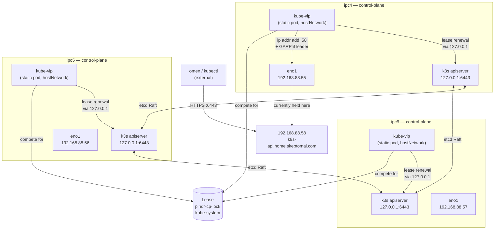
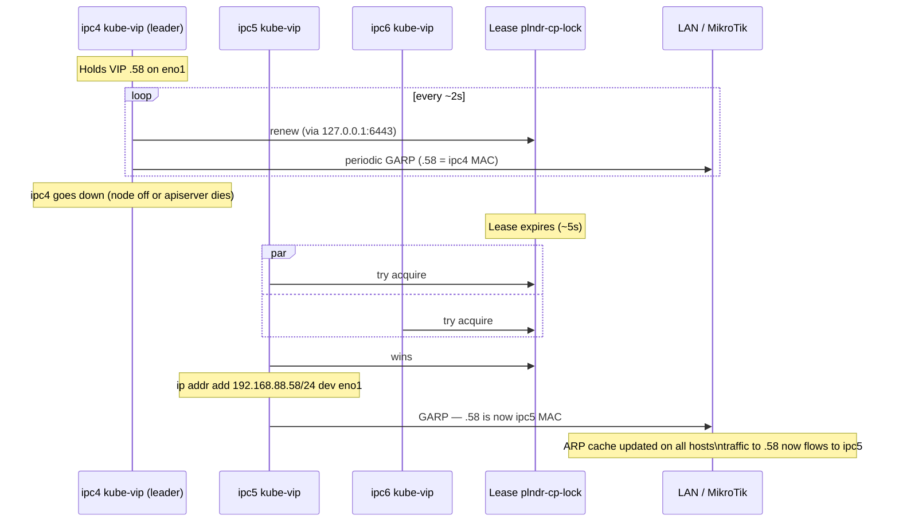
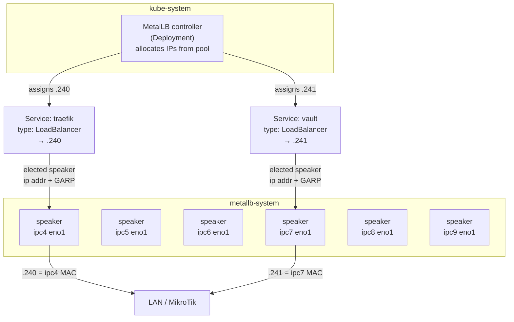
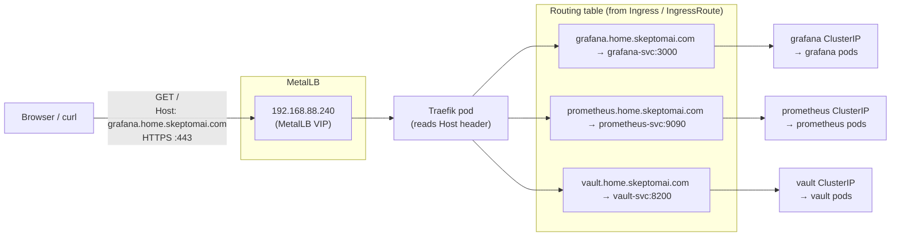
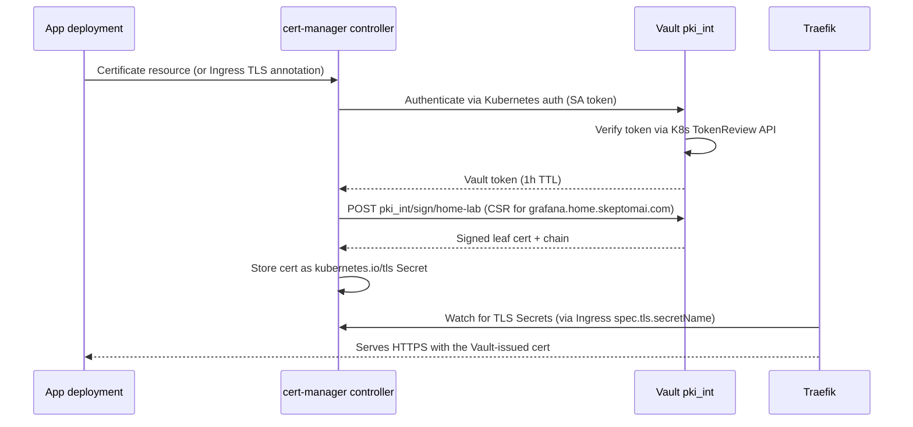

# VIP Architecture: kube-vip and MetalLB

Two separate systems handle virtual IPs in this cluster, at different layers and for
different purposes. They share the same L2/ARP mechanism but serve entirely different
roles.

---

## kube-vip — Control-Plane HA VIP

### Why it's different from a normal controller

Most Kubernetes controllers are Deployments or DaemonSets — they are *scheduled* by the
control plane and depend on the API server being reachable. kube-vip cannot work that way
because it *is* the thing that makes the API server reachable from outside. It solves a
bootstrapping problem.

kube-vip runs as a **static pod**: a manifest written to
`/var/lib/rancher/k3s/agent/pod-manifests/` on each control-plane node. The **kubelet**
reads that directory directly at startup and launches the pod without consulting the API
server. kube-vip is therefore running *before* etcd is healthy, *before* the API server
accepts connections, and *before* any scheduler exists.

### Architecture



### The local-apiserver trick

kube-vip's leader election uses a Kubernetes Lease object — but which API server does it
talk to? If it used the VIP itself (`.58:6443`), a dead local apiserver wouldn't affect
the lease, and the VIP would stay stuck on a broken node. Instead, kube-vip is configured
with:

```yaml
env:
  - name: KUBERNETES_SERVICE_HOST
    value: "127.0.0.1"
  - name: KUBERNETES_SERVICE_PORT
    value: "6443"
```

Each kube-vip pod talks *only* to its own node's apiserver on `127.0.0.1`. If that
apiserver dies, the local kube-vip can't renew the lease → it relinquishes leadership →
a node with a live apiserver takes over and the VIP floats.

### Failover sequence



The MAC address of `.58` **changes** on failover — this is the key difference from VRRP,
which keeps a constant virtual MAC. The gratuitous ARP is essential: without it every
device on the LAN would keep sending traffic to ipc4's (now silent) MAC until their ARP
cache timed out naturally.

### What kube-vip does NOT do

kube-vip is configured with `svc_enable=false` — it does not handle `type: LoadBalancer`
Services. That is MetalLB's job. kube-vip only manages the single control-plane VIP.

---

## MetalLB — Workload LoadBalancer VIPs

### Architecture

MetalLB is a standard Kubernetes controller — it runs as a normal Deployment and
DaemonSet, scheduled and managed by Kubernetes, with no bootstrapping concerns.

- **controller** (Deployment): watches for `type: LoadBalancer` Services and allocates
  IPs from the pool `192.168.88.240–.250`.
- **speaker** (DaemonSet, `hostNetwork: true`): runs on all 6 nodes. For each assigned
  IP, an elected speaker plumbs it onto its own `eno1` and answers ARP — same mechanism
  as kube-vip, different scope.



Each Service gets its own elected speaker — different Services can be announced from
different nodes simultaneously.

### Pool exhaustion isn't the workload limit

The pool `.240–.250` (11 IPs) does **not** cap the number of workloads you can run. It
caps the number of distinct external IPs. Traefik consumes one (`.240`) and acts as a
multiplexer for all HTTP/HTTPS traffic — dozens of web services share that single IP.
The remaining pool IPs are available for services that genuinely need a dedicated external
IP (raw TCP, UDP, non-HTTP protocols that can't share an ingress).

---

## Traefik — L7 Routing Behind `.240`

Traefik is the ingress controller. It holds a single `type: LoadBalancer` Service at
`.240`, receives all incoming HTTP/HTTPS traffic, and routes each request to the correct
backend based on the HTTP `Host` header (and optionally path).

### How Traefik knows where to route

Traefik watches the Kubernetes API for two kinds of routing rules:

1. **`Ingress` resources** (standard Kubernetes): specify host + path → Service name +
   port. Kubernetes-native, works with any ingress controller.
2. **`IngressRoute` CRDs** (Traefik-specific): richer routing — regex paths, middleware
   chains, TLS options, TCP routes — expressed as Traefik's own custom resources.

When you create either, Traefik builds an internal routing table and starts forwarding
matching traffic immediately — no restart required.

### Traffic flow



The flow for a single request:
1. Client resolves `grafana.home.skeptomai.com` → `192.168.88.240` (DNS)
2. TCP connection arrives at `.240:443`; MetalLB delivers it to the node whose speaker
   holds `.240` (currently ipc4)
3. Traefik terminates TLS, reads the decrypted `Host:` header
4. Matches against routing table → `grafana-svc:3000`
5. Proxies to the Grafana ClusterIP Service, which load-balances across Grafana pods

Traefik knows nothing about which node the pods are on — that's the ClusterIP Service's
job (backed by kube-proxy iptables rules on every node).

---

## TLS Termination and Certificate Management

### The problem Traefik has to solve

Traefik can terminate TLS for any hostname it receives traffic for, but it needs a
certificate valid for that name. The routing problem (which backend?) and the certificate
problem (where does the cert come from?) are completely separate.

### Where certs come from — options

**Built-in ACME (Let's Encrypt)**
Traefik has a built-in ACME client that can automatically obtain and renew certs. Two
challenge types:
- HTTP-01: Let's Encrypt verifies domain ownership by hitting `/.well-known/acme-challenge/` on port 80. Requires public inbound access — doesn't work for internal names like `grafana.home.skeptomai.com`.
- DNS-01: Traefik writes a TXT record via your DNS provider's API to prove ownership. Works for internal names and wildcard certs with no public exposure required. Rate-limited by Let's Encrypt.

Traefik stores ACME certs in a local JSON file (`acme.json`). In Kubernetes this is
problematic because pods are ephemeral — you need a PersistentVolume or you'll burn
through Let's Encrypt rate limits on every restart.

**cert-manager (the standard Kubernetes approach)**
cert-manager is a separate controller that manages the full certificate lifecycle and
stores results as Kubernetes TLS Secrets. Traefik reads those Secrets; it doesn't know or
care how cert-manager created them. cert-manager supports multiple issuers:

| Issuer type | How it works | Good for |
|---|---|---|
| SelfSigned | Generates a self-signed cert | bootstrap only |
| CA | Signs with a cert+key in a Kubernetes Secret | internal CA |
| ACME | Gets certs from Let's Encrypt (HTTP-01 or DNS-01) | public hostnames |
| Vault | Signs via Vault PKI secrets engine | private CA with audit trail |

**Default fallback**
If no cert matches the incoming hostname, Traefik falls back to a built-in self-signed
default cert — causing browser TLS warnings. This is the bare Traefik install state.

### Certificate chain in this cluster

This cluster uses a **Vault PKI intermediate CA** under a **self-signed internal root**:

```
internal-ca (self-signed, cert-manager manages, 10y lifetime)
  └── Vault pki_int (intermediate CA, signed by internal-ca, 5y lifetime)
        └── Leaf certs (issued by Vault PKI role 'home-lab', 1y max)
              - *.home.skeptomai.com
              - *.svc.cluster.local
```

**Why this hierarchy:**
- The internal-ca root is a single cert you install once in your browser/OS trust store.
  Every cert in the cluster is then automatically trusted — no per-service warnings.
- Vault PKI manages the intermediate CA key inside Vault's encrypted storage, with full
  audit logging of every cert issuance. cert-manager asks Vault to sign certs; the
  private key for the intermediate CA never leaves Vault.
- The intermediate CA layer means you can rotate the Vault PKI without touching the
  root cert that's installed in browsers.

### How a certificate gets issued (request flow)



### Vault Kubernetes auth — how it works

cert-manager authenticates to Vault without a static token:

1. cert-manager requests a short-lived token for its own ServiceAccount via the
   Kubernetes TokenRequest API.
2. It sends that token to Vault's `auth/kubernetes/login` endpoint.
3. Vault calls the Kubernetes TokenReview API to verify the token is valid and belongs to
   the `cert-manager` SA in the `cert-manager` namespace.
4. If valid, Vault returns a short-lived Vault token (1h) bound to the
   `cert-manager-pki` policy.
5. cert-manager uses that token to call `pki_int/sign/home-lab` and get the cert signed.

No static Vault tokens are stored anywhere in Kubernetes.

### Requesting a cert for an Ingress

```yaml
# Option A: Ingress annotation (cert-manager creates the Certificate automatically)
apiVersion: networking.k8s.io/v1
kind: Ingress
metadata:
  name: grafana
  annotations:
    cert-manager.io/cluster-issuer: vault-pki-issuer
spec:
  tls:
    - hosts: [grafana.home.skeptomai.com]
      secretName: grafana-tls   # cert-manager fills this
  rules:
    - host: grafana.home.skeptomai.com
      ...
```

```yaml
# Option B: Explicit Certificate resource (more control over renewal timing, etc.)
apiVersion: cert-manager.io/v1
kind: Certificate
metadata:
  name: grafana-tls
  namespace: monitoring
spec:
  secretName: grafana-tls
  duration: 8760h
  issuerRef:
    name: vault-pki-issuer
    kind: ClusterIssuer
  dnsNames:
    - grafana.home.skeptomai.com
```

### Setup

Vault PKI must be configured before the ClusterIssuer will become Ready:

```
bash scripts/setup-vault-pki.sh
kubectl apply -k manifests/vault-pki
kubectl get clusterissuer vault-pki-issuer
```

The setup script:
1. Enables `pki_int` in Vault
2. Generates the intermediate CA CSR (private key stays in Vault)
3. Signs the CSR via cert-manager's `internal-ca-issuer`
4. Imports the signed cert chain back into Vault
5. Creates the `home-lab` role and Kubernetes auth configuration

### Does SPIRE play any role here?

No — and it's worth being precise about why.

SPIRE issues **X.509 SVIDs**: short-lived certificates with SPIFFE URI SANs
(`spiffe://ipc.local/ns/foo/sa/bar`), not DNS SANs. SVIDs are workload *identity*
credentials used for pod-to-pod mTLS — they are not browser-trusted and are not suitable
for HTTP ingress TLS.

In this cluster, SPIRE uses its own self-managed CA (trust domain `ipc.local`), entirely
separate from the Vault PKI / internal-ca chain. The two trust hierarchies do not
intersect:

| | SPIRE SVIDs | Ingress TLS (Vault PKI) |
|---|---|---|
| Purpose | Pod-to-pod mTLS (workload identity) | Browser HTTPS (ingress TLS) |
| SANs | SPIFFE URI (`spiffe://ipc.local/...`) | DNS names (`*.home.skeptomai.com`) |
| Lifetime | Minutes to hours (auto-rotated by SPIRE) | Days to a year (cert-manager managed) |
| Trust root | SPIRE's own CA (`ipc.local`) | internal-ca (self-signed) |
| Browser trusted? | No | Yes, if internal-ca is installed |

The integration point that *could* exist (but isn't configured here): Vault can be
SPIRE's upstream authority, making Vault PKI the root for both SVID issuance and ingress
TLS. In that scenario a single Vault PKI root would cover everything and you'd only need
one cert in your browser trust store. This is a valid future evolution but adds
operational complexity.

---

## Side-by-side comparison

| | kube-vip | MetalLB |
|---|---|---|
| Purpose | Control-plane HA | Workload `LoadBalancer` Services |
| VIP(s) | One: `192.168.88.58` | Many: `192.168.88.240–.250` |
| Runs as | Static pod (kubelet, no scheduler) | Deployment + DaemonSet (normal) |
| hostNetwork | Yes | Yes (speaker only) |
| ARP mechanism | GARP from real MAC | GARP from real MAC |
| MAC on failover | Changes | Changes |
| vs. VRRP | No virtual MAC | No virtual MAC |
| Leader election | Kubernetes Lease (via `127.0.0.1`) | Per-Service elected speaker |
| Cluster dependency | None — predates the cluster | Full — requires running cluster |
| L7 routing | No | No (MetalLB is L3/L4 only — Traefik does L7) |
